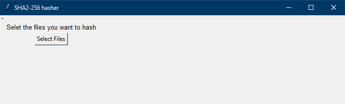
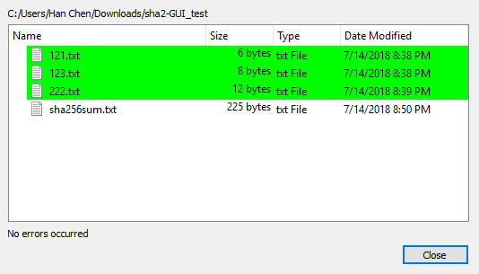

# SHA2-256-Hasher-GUI-in-Python-3

An ultra-simple graphic-user-interface (GUI) that hashes files for you, using SHA2-256 hashing function (the same one Bitcoin, Bitcoin Cash, and PGP uses).

## What does this graphic-user-interface (GUI) do?
1. Display the SHA2-256 hashes of the selected files
2. Generate a sha256sum.txt, which can be verified using PGP!

## How to use:
0. Make sure you have ```tkinter```, ```hashlib```, ```os```, and ```glob``` packages
1. Download the file "sha2.py"
2. Set your working directory to where "sha2.py" is in Python 3
3. Initiate GUI by command ```import sha2()```
4. Select files in GUI to hash away!

## Demostrations:
* The GUI



* Hashing three selected files, displaying the SHA2-256 hashes of said files


* Generating "sha256sum.txt" file


* "sha256sum.txt" file can be verified using a PGP client!


